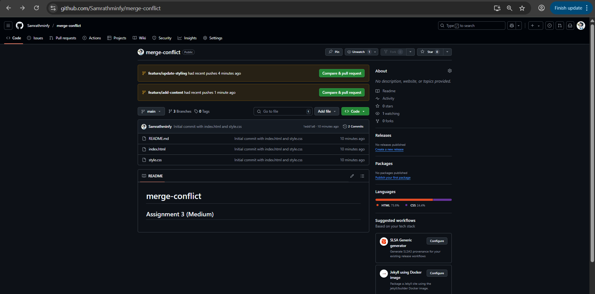
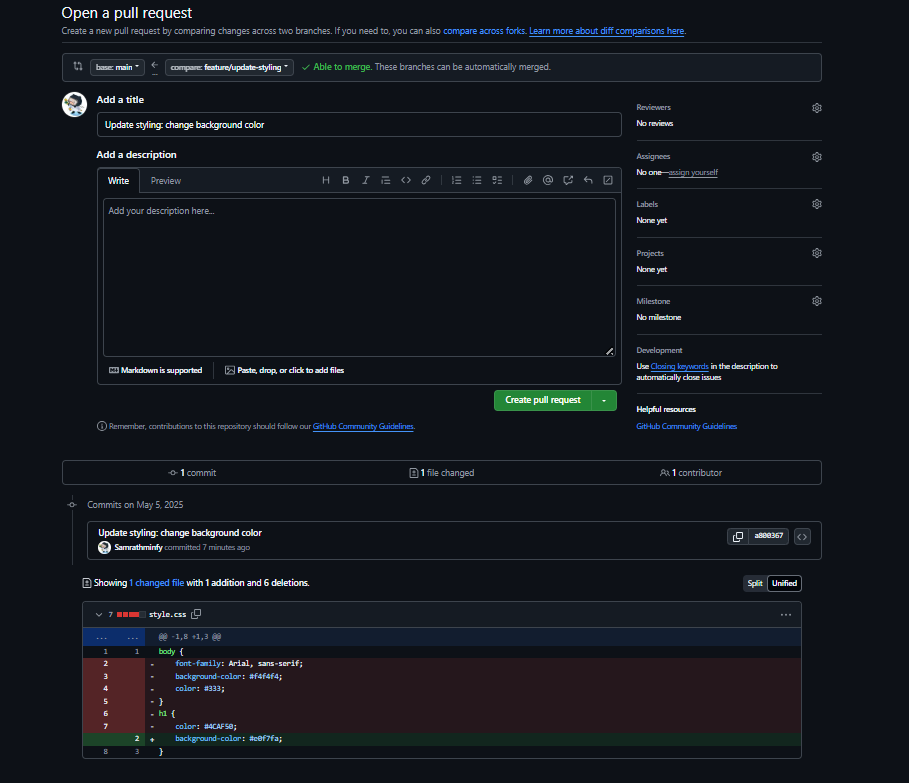
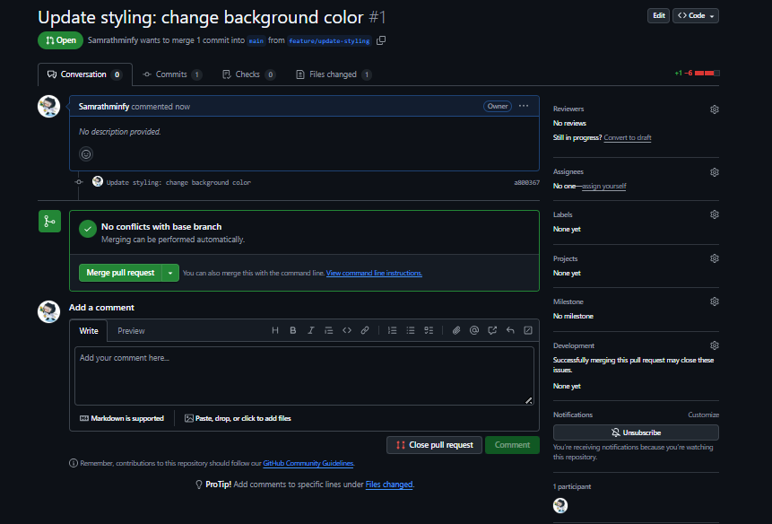
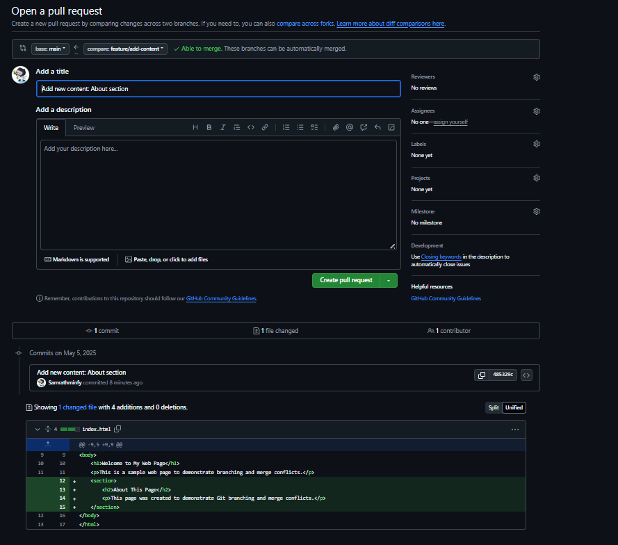
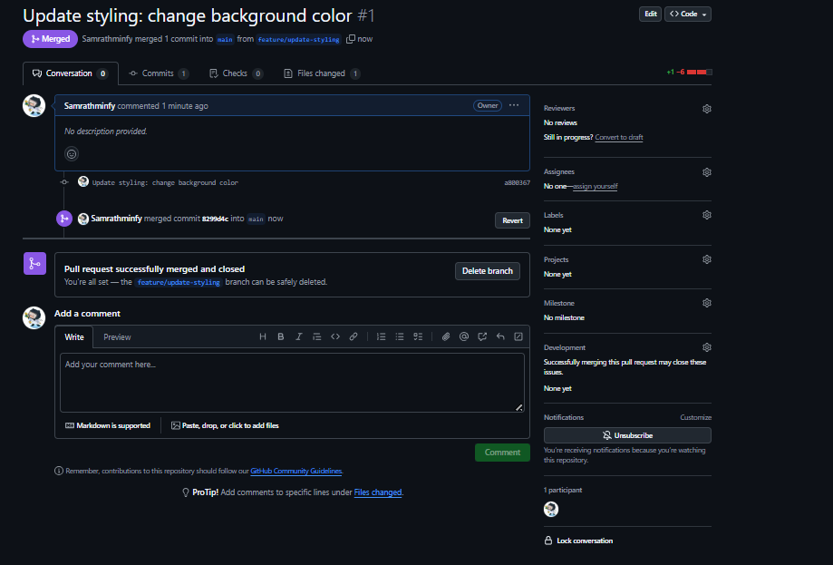
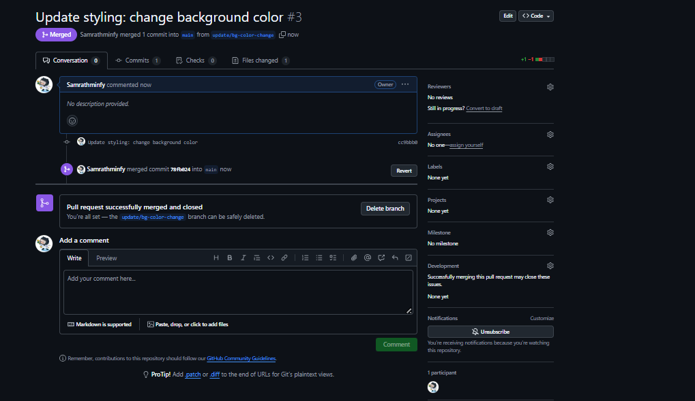

# Assignment 3: Branching Strategies & Merge Conflicts

## Objective
This assignment demonstrates the practical use of **GitHub Flow**, creating and merging branches, and resolving merge conflicts in a collaborative environment.

---

## Tasks Completed

1. Created a new Git repository using GitHub Flow.
2. Developed a simple HTML/CSS web page.
3. Created two feature branches:
   - `feature/update-styling`: Modified styles and formatting.
   - `feature/add-content`: Added new content to the HTML file.
4. Made conflicting changes to the same file (`index.html`) on both branches.
5. Opened pull requests for both branches.
6. Merged one branch into `main`.
7. Experienced the merge conflict with the second pull request.
8. Resolved the merge conflict and successfully merged both branches.

---

## Merge Conflict Explanation

Merge conflicts occur when two branches modify the **same lines** in a file differently, and Git cannot automatically decide which version to keep. In this case, both `feature/update-styling` and `feature/add-content` made changes to the `
` tag in `index.html`.

> ⚠️ **Note**: Since both pull requests were created and merged from **the same GitHub account**, GitHub may automatically resolve changes without a visible conflict. In a real team setup, a conflict would be detected and require manual resolution.

---

## Screenshots

### 1. Pull Request for Both Branches

### 2. Comparing Changes

### 3. Merging First Branch

### 4. Pull Request for Second Branch

### 5. Successful Merge

### 6. Final Confirmation

---

## Conclusion

This assignment helped demonstrate GitHub branching strategies, especially the handling of **pull requests** and **conflict resolution**. Even though the conflict wasn’t triggered due to same-account usage, the setup and process reflected real-world team collaboration.